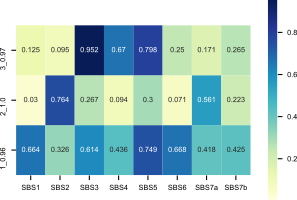
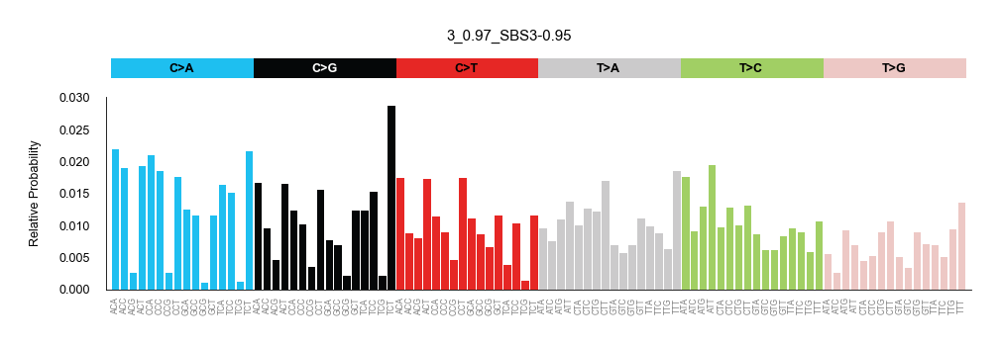
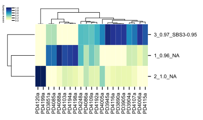

======================
Postprocessing utilies
======================

|

SigProfilerJulia has evaluated N different possible signatures active in the samples.
The following scripts should help the user to:

* Decide the specific number of signatures active in the tumors where we performed
  the extraction.

* Compare them with previously extracted signatures in COSMIC (either exome or WGS), plotting the profiles and clustering exposures.

|

---------------------
Software dependencies
---------------------

The requirements are the same as in the preprocessing step. If you have already installed all the dependencies, you can skip this section.

For Linux users, we recommend installing python and the script dependencies using conda:

.. code-block::

  $ conda create -n sigprofilerjulia python=3.6 tqdm click pandas matplotlib=3.1.0 scipy seaborn=0.9.0
  $ conda activate sigprofilerjulia
  $ conda install -c bbglab bgreference

Alternatively, the packages can be installed using pip:

.. code-block::

  $ pip install tqdm click pandas matplotlib==3.1.0 scipy seaborn==0.9.0 bgreference

For OSX users, all the dependencies must be installed using pip. The scripts were not tested in Windows systems.

|

----------------------------------------
A) Deciding the number of active signatures
----------------------------------------

The first script, **plot_select_signatures.py**, will plot the mean average stability of the extracted processes (red) in each N number of signatures and the reconstruction
error (yellow). The stability of each signature within each number of signatures is also represented. For further analysis,
you should select the number of K signatures where the stability is higher and the reconstruction error is lower. In the following
example, we would select K = 4, implying that we have detected 4 signatures active in our samples with confidence.

.. image:: ../test/output/21_breast_WGS_substitutions_summary/signatures_analysis.png
   :height: 100px
   :width: 200 px
   :scale: 10 %

|

For further downstream analyses the original exposures and processes files will be saved with
the new signature names.

|

Example
-------

The following command will generate the plot above, using data from the extraction of 21 breast WGS using SigProfilerJulia.

.. code-block::

  $ python plot_select_signatures.py --path_results ../test/output/21_breast_WGS.snvs/

|

Arguments
---------

* ``--path_results``

  - Path that was used as an outpath in SigProfilerJulia extraction. It will also be used as an outpath to save the plot.

|

-----------------------------------
B) Processing the signature extraction
-----------------------------------

As soon as we have decided how many signatures are active in our samples, we can do the following:

* Compare our results with previously extracted signatures in COSMIC, using the cosine similarity as a measure.
* Plotting each of the mutational profiles
* Clustering samples based on signature exposure.

The script **process_signature_extraction.py** does all of the above. First, it will add the stability value of each of the
extracted signatures in each signature label. Then, it will calculate the cosine similarity for all the COSMIC signatures, if
the value is higher than a threshold (by default 0.85, but this can be changed by the user, see below), this will be added in the signature
label too. If it is not similar to any COSMIC signature, it will add a NA to the label. At the very end, extracted signatures will have
the following label: A_B_C, where A is the number of the extracted signature, B is the stability during the extraction, and C is either
the COSMIC similar signature and the cosine similarity value, or NA if it did not pass the threshold.

It is important to remark that the scripts assumes by default the samples are WGS, if they are exome-sequenced a flag must be specified (see below).

|

During this evaluation, it will also plot a heatmap of the cosine distances with the extracted signatures versus all COSMIC signatures.

|

It will automatically plot the mutational profile of each of the extracted signatures with the new labels:

|

Finally, a clustermap of the exposures in the samples will also be generated:

|

Example
-------

The following command will assess the cosine similarity, plot the mutational distribution and cluster exposures using data from the extraction of 21 breast WGS using SigProfilerJulia,
assuming there are K=3 active signatures.

.. code-block::

  $ python process_signature_extraction.py --path_results ../test/output/21_breast_WGS.snvs/ --sigs_active 3 --outpath ../test/output/extraction_processed/

|

Arguments
---------

* ``--path_results``

  - Path that was used as an outpath in SigProfilerJulia extraction.

* ``--sigs_active``

  - Number of K signatures active in the samples.

* ``--outpath``

  - Path that will be used to save the results. In the folder, two subfolders will be created, processes/ (where the cosine similarity
    analysis and the signature plots will be saved) and exposures/.

* ``--signature_similarity_cutoff [default=0.85]``

  - Cutoff to decide whether the signature resembles a previous signature.

* ``--exome  [default=False]``

  - The script will compare the extracted signatures to COSMIC WGS signatures. If this flag is passed, it will compare with
    whole-exome-sequenced normalized signatures.

|
